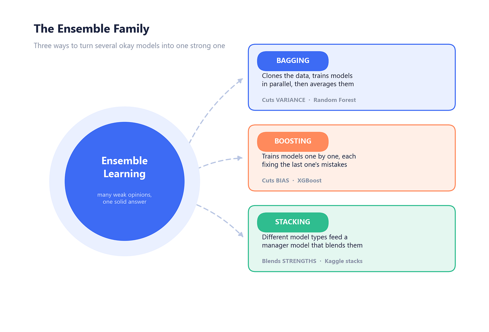
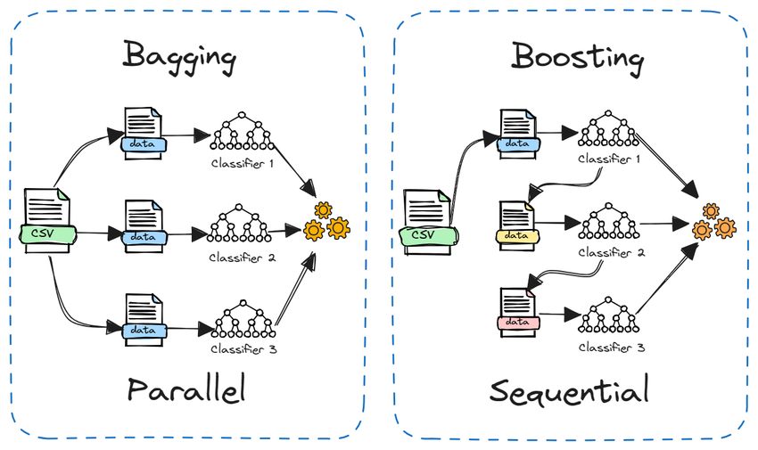
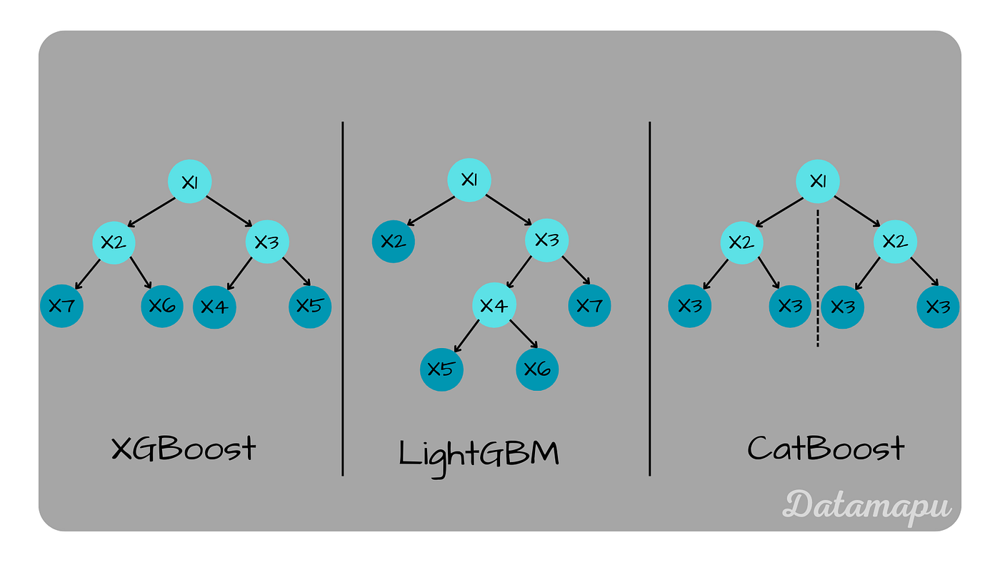
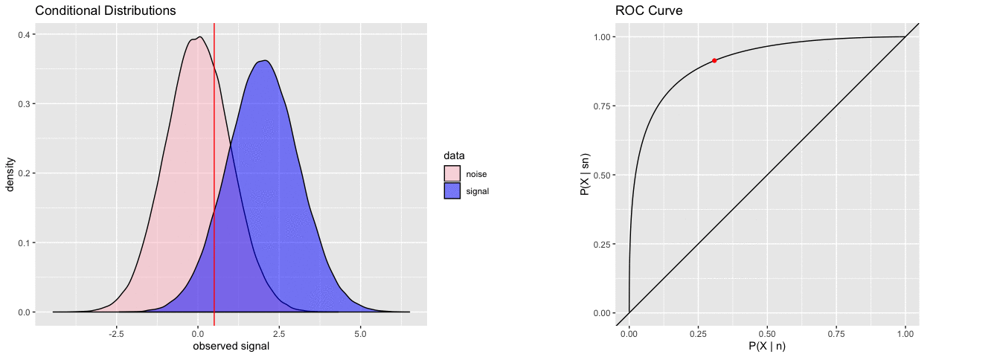
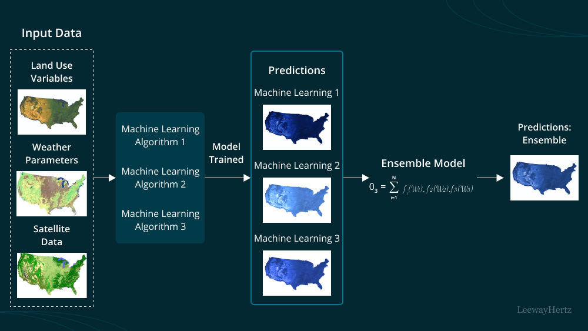

# Advanced Machine Learning Algorithms:

A structured, hands-on collection of notebooks and resources covering ensemble learning methods in machine learning — from foundational bagging techniques to modern gradient boosting frameworks, with a final project applying and comparing these algorithms on a real dataset.

 

## 📚 Contents

| # | Topic | Description |
|---|-------|-------------|
| 1 | **Introduction to Ensemble Learning** | Core concepts behind combining multiple models to improve predictive performance |
| 2 | **Bagging and Random Forests** | Bootstrap aggregation, variance reduction, and the Random Forest algorithm |
| 3 | **Boosting and Gradient Boosting** | Sequential model building, residual fitting, and the Gradient Boosting framework |
| 4 | **Introduction to XGBoost** | Regularized gradient boosting, tree pruning, and performance optimizations |
| 5 | **LightGBM and CatBoost** | Leaf-wise growth, categorical feature handling, and efficient large-scale boosting |
| 6 | **Handling Imbalanced Data** | Resampling techniques, class weighting, and evaluation metrics for skewed datasets |
| 7 | **Ensemble Learning Project** | End-to-end project comparing ensemble models on a real-world dataset |

## 🎯 Objectives

- Build an intuitive and practical understanding of ensemble learning techniques


- Implement bagging- and boosting-based algorithms from the ground up and using popular libraries

 
- Compare the strengths, trade-offs, and use cases of Random Forests, Gradient Boosting, XGBoost, LightGBM, and CatBoost


- Apply strategies for handling imbalanced datasets in real-world scenarios


- Consolidate learning through a comparative project on a real dataset


## 🛠️ Tech Stack

- **Language:** Python
- **Libraries:** scikit-learn, XGBoost, LightGBM, CatBoost, pandas, NumPy, Matplotlib/Seaborn
- **Environment:** Jupyter Notebook

## 📂 Repository Structure

```
Machine-Learning-Algorithms/
│
├── 01_Introduction_to_Ensemble_Learning/
├── 02_Bagging_and_Random_Forests/
├── 03_Boosting_and_Gradient_Boosting/
├── 04_Introduction_to_XGBoost/
├── 05_LightGBM_and_CatBoost/
├── 06_Handling_Imbalanced_Data/
├── 07_Ensemble_Learning_Project/
└── README.md
```

## 🚀 Getting Started

1. Clone the repository
   ```bash
   git clone https://github.com/<your-username>/Advanced-Machine-Learning-Algorithms.git
   cd Advanced-Machine-Learning-Algorithms
   ```
2. Install dependencies
   ```bash
   pip install -r requirements.txt
   ```
3. Launch Jupyter Notebook and explore the folders in order
   ```bash
   jupyter notebook
   ```

## 📈 Project Highlight

The final module, **Ensemble Learning Project**, brings together everything covered in the repository — applying and benchmarking Random Forests, Gradient Boosting, XGBoost, LightGBM, and CatBoost on a real dataset, with a comparative analysis of accuracy, training time, and robustness to imbalanced classes.


## 📄 License

This project is open source and available under the [MIT License](LICENSE).

## 🤝 Contributing

Contributions, suggestions, and improvements are welcome. Feel free to open an issue or submit a pull request.
