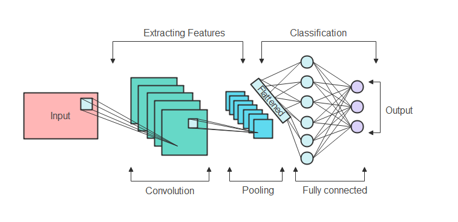
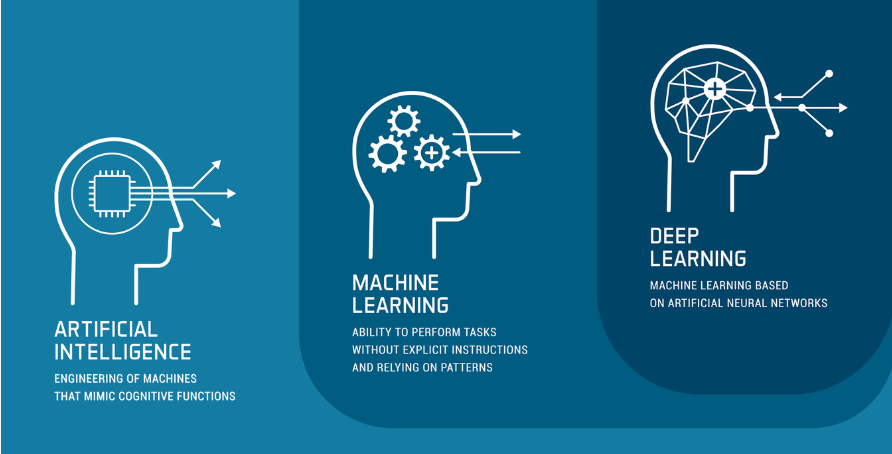
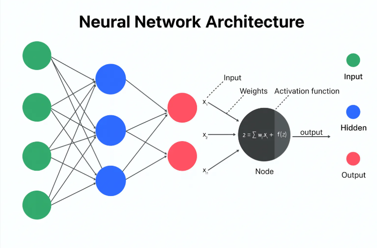
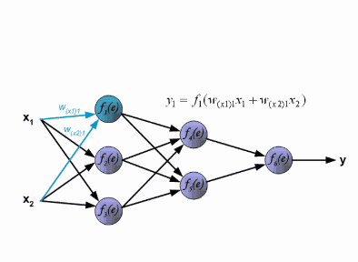
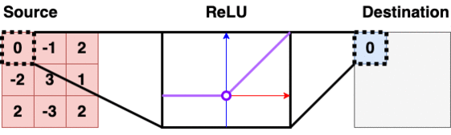
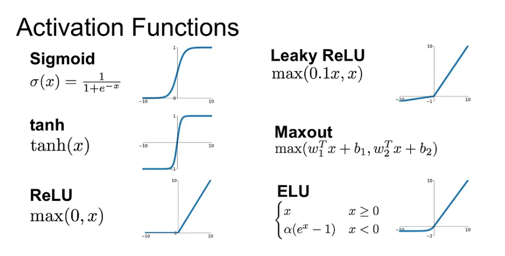
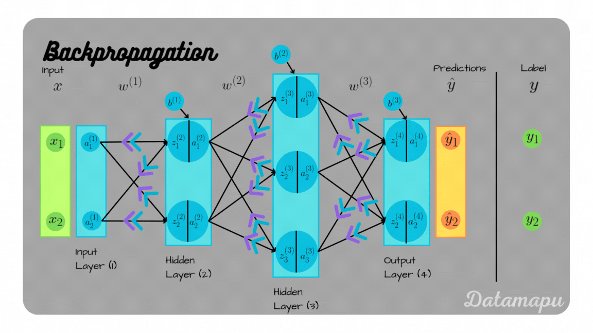
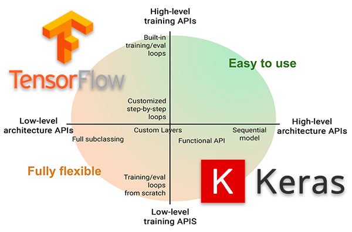

# Neural Networks and Deep Learning Fundamentals

<table>
  <tr>
    <td width="50%" valign="top" align="center">
      
      <p>Neural Network</p>
    </td>
    <td width="50%" valign="top" align="center">
      
      <p>Deep Learning</p>
    </td>
  </tr>
</table>

A practical and structured introduction to neural networks and deep learning, covering the fundamentals required to understand, build, train, and evaluate deep learning models.

This repository combines conceptual learning with hands-on implementation using TensorFlow, Keras, and PyTorch. The content is organized as a progressive seven-day learning path, starting with the foundations of neural networks and concluding with an image classification project using the CIFAR-10 dataset.

## Learning Objectives

By completing this repository, you will be able to:

- Explain the basic concepts behind neural networks and deep learning.
- Understand how data flows through a neural network.
- Implement forward propagation and activation functions.
- Understand loss functions and the backpropagation algorithm.
- Apply gradient descent and common optimization techniques.
- Build neural networks using TensorFlow and Keras.
- Build and train neural networks using PyTorch.
- Develop an image classification model using the CIFAR-10 dataset.
- Evaluate model performance and identify opportunities for improvement.
- Structure machine learning experiments in a clear and maintainable manner.

## Repository Structure

###  1: Introduction to Deep Learning and Neural Networks

Introduces the fundamentals of artificial intelligence, machine learning, deep learning, and neural networks.


Topics include:

- Artificial neurons
- Neural network architecture
- Input, hidden, and output layers
- Weights and biases
- The role of deep learning in modern software systems

###  2: Forward Propagation and Activation Functions

Explains how input data moves through a neural network to generate predictions.

<table>
  <tr>
    <td width="50%" valign="top" align="center">
      
      <p>Forward Propagation</p>
    </td>
    <td width="50%" >
      
      <p>Activation Functions</p>
    </td>
  </tr>
</table>
Topics include:

- Forward propagation
- Weighted sums
- Bias terms
- Activation functions

   
   
- ReLU
- Sigmoid
- Tanh
- Softmax
- Choosing activation functions for different tasks

### 3: Loss Functions and Backpropagation

Covers how neural networks measure prediction errors and learn from them.


Topics include:

- Loss functions
- Mean squared error
- Binary cross-entropy
- Categorical cross-entropy
- Backpropagation
- Partial derivatives
- The chain rule
- Gradient calculation

###  4: Gradient Descent and Optimization Techniques

Explores the optimization algorithms used to minimize loss and improve model performance.

  
      <p align="center">Gradient Descent Methods (Momentum,AdaGrad,RMSProp,Adam)</p>

Topics include:

- Gradient descent
- Learning rate
- Batch gradient descent
- Stochastic gradient descent
- Mini-batch gradient descent
- Momentum
- Adaptive optimization
- Adam optimizer
- Training stability and convergence

###  5: Building Neural Networks with TensorFlow and Keras

Demonstrates how to build, compile, train, and evaluate neural networks using TensorFlow and Keras.


  
  
Topics include:

- Model construction
- Sequential and functional APIs
- Dense layers
- Model compilation
- Optimizers and loss functions
- Training and validation
- Callbacks
- Performance evaluation

### 6: Building Neural Networks with PyTorch

Introduces the PyTorch approach to neural network development.

      
Topics include:

- Tensors
- Dataset and DataLoader abstractions
- Defining neural network modules
- Forward passes
- Training loops
- Gradient management
- Optimizers
- Model evaluation
- Saving and loading model checkpoints

### 7: Neural Network Project — CIFAR-10 Image Classification

Applies the concepts covered throughout the repository to an end-to-end image classification problem.

The project includes:

- Loading and preprocessing the CIFAR-10 dataset
- Defining an image classification model
- Training the model
- Validating model performance
- Evaluating test accuracy
- Analyzing predictions
- Identifying potential improvements

## Technology Stack

- Python
- TensorFlow
- Keras
- PyTorch
- NumPy
- Matplotlib
- Jupyter Notebook

## Repository Structure

```text
.
├── README.md
├── day-01-introduction/
│   └── ...
├── day-02-forward-propagation/
│   └── ...
├── day-03-loss-and-backpropagation/
│   └── ...
├── day-04-gradient-descent/
│   └── ...
├── day-05-tensorflow-keras/
│   └── ...
├── day-06-pytorch/
│   └── ...
└── day-07-cifar10-project/
    └── ...
```

> The directory structure may evolve as the implementation develops. The primary goal is to keep concepts, experiments, and project code clearly separated.

## Prerequisites

Before working through this repository, it is recommended that you have:

- Basic Python programming knowledge.
- Familiarity with functions, classes, and modules.
- A general understanding of linear algebra and probability.
- Basic knowledge of software development workflows.
- Experience working with virtual environments and package managers.

Prior experience with machine learning is helpful but not required.

## Getting Started

### 1. Clone the repository

```bash
git clone <repository-url>
cd neural-networks-and-deep-learning-fundamentals
```

### 2. Create a virtual environment

```bash
python -m venv .venv
```

Activate the environment on macOS or Linux:

```bash
source .venv/bin/activate
```

Activate the environment on Windows:

```bash
.venv\Scripts\activate
```

### 3. Install dependencies

```bash
pip install -r requirements.txt
```

If a requirements file is not available, install the primary dependencies manually:

```bash
pip install numpy matplotlib tensorflow torch torchvision jupyter
```

### 4. Start Jupyter Notebook

```bash
jupyter notebook
```

Open the notebooks in sequence, beginning with Day 1 and continuing through the CIFAR-10 project.

## Recommended Learning Approach

For the best results:

1. Review the concepts before executing the implementation.
2. Run each example locally and inspect the output.
3. Modify hyperparameters and observe their impact.
4. Compare different activation functions and optimizers.
5. Track training and validation metrics.
6. Document observations and unexpected results.
7. Refactor experimental code into reusable components.
8. Use the final project to reinforce the concepts from each day.

## Engineering Practices

This repository follows practical software engineering principles commonly used in production-oriented machine learning projects:

- Clear separation between experiments, reusable code, and datasets.
- Reproducible experiments through controlled random seeds.
- Consistent naming conventions.
- Explicit configuration of model and training parameters.
- Proper separation of training, validation, and test data.
- Meaningful metric tracking.
- Modular and readable code.
- Documented assumptions and implementation decisions.
- Avoidance of data leakage during model development.
- Version-controlled source code without committing generated datasets or model artifacts.

## Model Evaluation

Model performance should not be evaluated using accuracy alone. Depending on the task, evaluation may include:

- Training and validation loss.
- Training and validation accuracy.
- Precision.
- Recall.
- F1-score.
- Confusion matrix.
- Class-level performance.
- Inference behavior on unseen examples.

For the CIFAR-10 project, special attention should be given to class imbalance, misclassified examples, overfitting, and the difference between training and test performance.

## Potential Improvements

Possible extensions to this repository include:

- Implementing neural networks from scratch using NumPy.
- Adding convolutional neural networks for image classification.
- Introducing batch normalization and dropout.
- Applying data augmentation.
- Comparing different optimizers.
- Adding learning-rate scheduling.
- Tracking experiments with MLflow or Weights & Biases.
- Adding automated tests for reusable components.
- Containerizing the project with Docker.
- Adding continuous integration checks.
- Exposing the trained model through a REST API.
- Deploying the model as a small inference service.

## Contribution Guidelines

Contributions are welcome. When contributing:

1. Create a separate feature branch.
2. Keep changes focused and appropriately scoped.
3. Follow the existing project structure.
4. Add or update documentation where necessary.
5. Validate notebooks and scripts before submitting a pull request.
6. Avoid committing large datasets, credentials, or generated model files.
7. Include a clear description of the change and its purpose.

## License

This project is intended for educational and experimental purposes. Add an appropriate open-source license, such as the MIT License, before distributing the repository publicly.

## Author

Developed as a structured learning project for building a strong foundation in neural networks, deep learning, and practical machine learning engineering.
